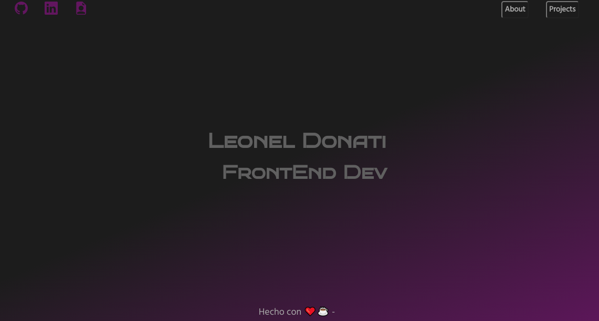
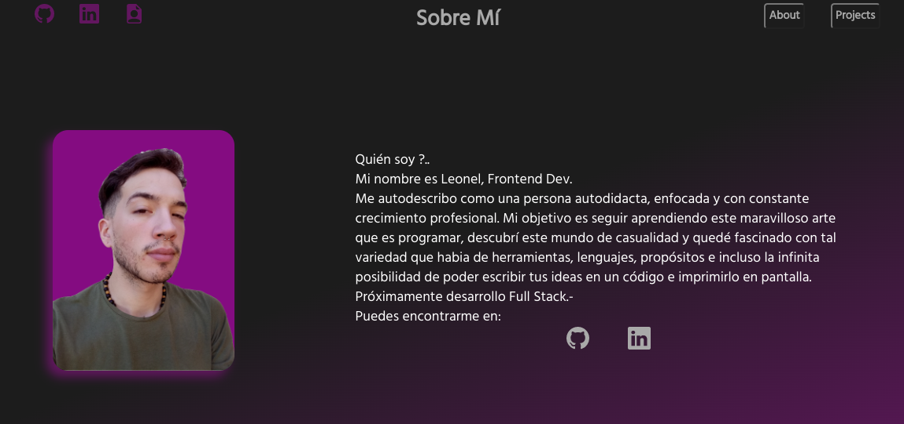
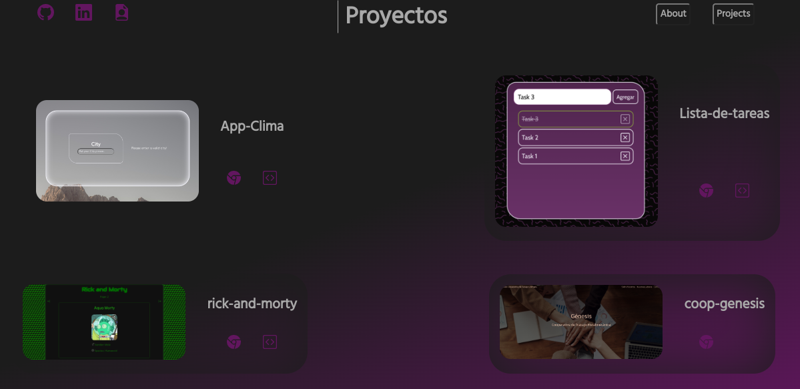

# Portafolio creado con React JS & Vite JS.

### Se utilizó UUID para mapeo de datos.


## Se utilizo * createContext * para creado de contexto global.
---
```jsx
import { createContext } from "react";
import { v4 as uuidv4 } from "uuid";


const data = {/* DATOS GLOBALES */};

export const GlobalContext = createContext();

export const Provider = ({ children }) => {
  return (
    <GlobalContext.Provider value={data}>{children}</GlobalContext.Provider>
  );
};


```
>CONTEXTO GLOBAL APP

## Capturas de pantalla.
---

>Inicio de página



>Sección sobre mí



>Sección proyectos



Si gustas mirar mas a fondo el proyecto podes revisar el repo que tengo en GitHub!

*Leonel Donati . -*

